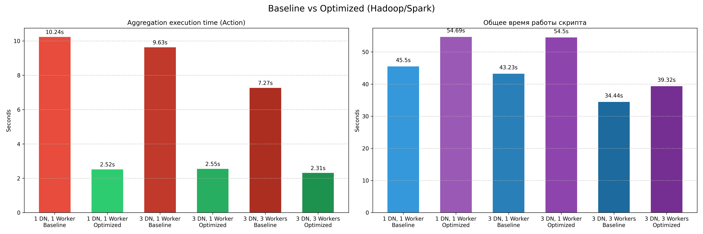
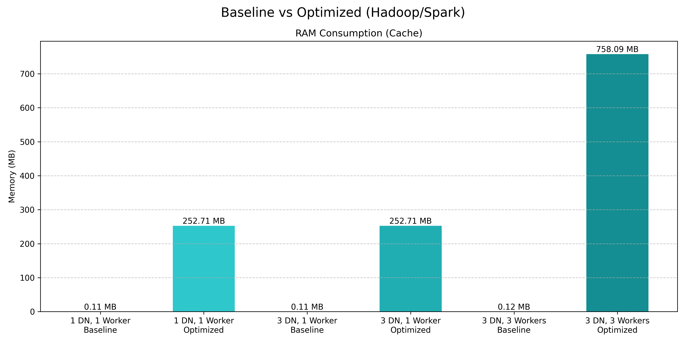

# Hadoop/Spark Lab

## Подготовка системы

В рамках данной работы проводится оценка производительности распределенной обработки данных для датасета [NYC Yellow Taxi Trip Data](https://www.kaggle.com/datasets/elemento/nyc-yellow-taxi-trip-data) (1.7 ГБ, 11кк строк, 19 признаков) с использованием Apache Hadoop и Apache Spark.
Эксперименты проводятся в Docker-среде с жестко ограниченными ресурсами: 2 CPU Core и 2 GB RAM (с аллокацией `spark.executor.memory=2g`) на каждый вычислительный узел. Конфигурацию системы можно посмотреть в [docker-compose.yaml](docker-compose.yaml):

**Конфигурации кратко**:
1. 1 data-node, 1 worker - покажет "сырую" производительность без издержек на shuffle и репликацию
2. 3 data-node, 1 worker - масштабирование слоя хранения. Файл размером 1.7 ГБ физически разбивается на HDFS-блоки по 128 МБ (по идее ~13 блоков) и располагается на 3 узла. Агрегация (CPU-bound задача) всё ещё выполняется на 1 воркере
3. 3 data-node, 3 worker - полноценное горизонтальное масштабирование. Ожидается, что CPU-bound нагрузка при вычислении агрегатов будет равномерно распределена между тремя воркерами, что должно сильно сократить время работы DAG

**Реализованы два пайплайна**:
1. [Baseline](code/baseline.py): неоптимизированный ETL-процесс. Включает динамический вывод схемы (`inferSchema=True`), отсутствие кэширования и перераспределения партиций. Данные читаются с диска при каждом вызове действия (имею в виду Action, не знаю, как правильно перевести)
2. [Optimized](code/optimized.py): оптимизированный пайплайн. Использует явно заданную схемы данных (`StructType`), принудительное репартиционирование (`.repartition(12)`) для выравнивания нагрузки на воркерах и кэширование датасета в оперативной памяти executor'ов (`.cache()`), чтобы вычисления выполнялись на месте вместо того, чтобы нести данные к вычислениям

Для каждого из 6 запусков (3 конфига x 2 пайплайна) **логируются следующие метрики**:
- Время первичной загрузки и подготовки данных (I/O, shuffle и т.п.)
- Время выполнения **трансформации данных** (далее в тексте буду так называть). Включает в себя несколько операций: фильтрация значений колонки `trip_distance` (длина маршрута), группировка по `VendorID` (идентификатор провайдера таксометров), агрегация - количество поездок и средняя длина маршрута, сортировка по количеству поездок у вендора. Вендоров в датасете всего 2
- Распределение закэшированных данных по узлам. Эту информацию можно вытащить через [эндпоинт самого Spark](https://spark.apache.org/docs/latest/monitoring.html#executor-metrics)

> NOTE: эксперименты запускалиcь 5 раз, результаты усреднялись. Поэтому на графике числа отличаются от тех, что даны в логах в папке `/docs` (там один запуск системы)

## Результаты

На **графике 1** показаны результаты по производительности операции трансформации данных и общее время работы скрипта (то есть вместе с загрузкой данных, определением типов данных и т.д.).
На **графике 2** представлены замеры кэшированной в RAM памяти суммарно по всем воркерам.
Ссылки далее в анализе ведут на логи одного запуска системы для конкретной конфигурации.

> График 1

> График 2

### 1 Data-Node, 1 Worker

**[Baseline](docs/baseline-1-dh-1-w.log)**: скрипт обрабатывал данные с диска, так как тут невключено кэширование. Динамическое определение схемы данных привело к жёстким затратам по времени на старте. Итоговое время агрегации составило 10.24 сек., общее время выполнения - 45.5 сек. Память executor'а для кэша не задействовалась (0.11 MB).

**[Optimized](docs/optimized-1-dh-1-w.log)**: тут у нас кэширование + явная схема данных. Согласно логам Spark, реальный объем распакованного датасета составил около 758 MB. Так как одному executor'у по умолчанию выделяется ~434 МБ под хранение, то случилось ужасное - часть данных была сброшена из RAM на диск контейнера, что в итоге создаёт некоторый боттлнек в ходе обработки данных. Так или иначе время выполнения нрансформации данных резко сократилось до 2.52 сек. Общее время увеличилось до 54.69 сек из-за накладных расходов на репартиционирование и запись на диск/в память.

### 3 Data-Nodes, 1 Worker

**[Baseline](docs/baseline-3-dh-1-w.log)**: распределение блоков по трем узлам HDFS ускорило чтение данных. Однако время трансформации данных снизилось незначительно - до 9.63 сек., так как вычисления по прежнему выполняется на одной ноде. Общее время: 43.23 сек.

**[Optimized](docs/optimized-3-dh-1-w.log)**: время трансформации данных составило 2.55 сек., общее время - 54.5 сек. Метрики практически идентичны предыдущей конфигурации, так как воркер по-прежнему один и проблема нехватки памяти (из-за ограничения 434 МБ хранения в RAM) сохраняется.

### 3 Data-Nodes, 3 Workers

**[Baseline](docs/baseline-3-dh-3-w.log)**: добавление воркеров дало заметный результат по перформансу. Время трансформации данных снизилось до 7.27 сек. Ускорение не является линейным (в 3 раза) как минимум потому, что `groupBy` требует вызова shuffle между тремя контейнерами. Общее время работы скрипта достигло минимума для бейзлайна - 34.44 сек.

**[Optimized](docs/optimized-3-dh-3-w.log)**: закэшированные 758 МБ равномерно распределились трём воркерам (~252 МБ на каждый). Данные теперь полностью находятся в RAM, а это значит, что воркерам не придётся ходить далеко, чтобы достать данные для вычислений. Трансформация данных выполнилась за 2.31 сек., общее время составило 39.32 сек.
